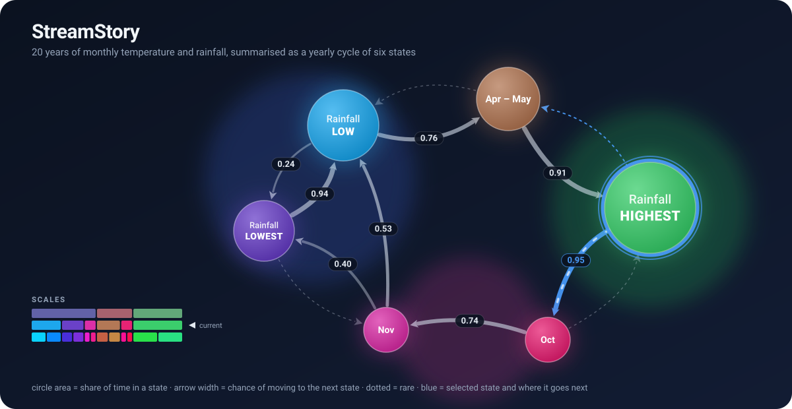

# StreamStory

Interactive exploration of multivariate time series on multiple scales.

<p align="center">
  
</p>

StreamStory turns high-dimensional time series into an interpretable, hierarchical
model of qualitative states and the transitions between them. You can zoom from
coarse, long-term behaviour down to fine detail, see what characterises each state,
and follow how the system moves over time — all in the browser.

A hosted instance is available at [streamstory.ijs.si](http://streamstory.ijs.si/).

## Quick start

Requires Docker and Docker Compose.

```bash
git clone https://github.com/E3-JSI/StreamStory2.git
cd StreamStory2
npm run build   # build the service images
npm run start   # start the stack: api, client, db, modelling
```

The web client is then served on the configured port (80 by default). Use
`npm run log` to follow logs and `npm run stop` to tear the stack down. For local
development with hot reloading, use `npm run build:dev` and `npm run start:dev`.

## Documentation

- [Architecture](docs/architecture.md) — services, ports, and how they fit together.
- [Development](docs/development.md) — running the stack locally and project layout.
- [Deployment](docs/deployment.md) — configuration and production deployment.
- [Public API](docs/public-api.md) — the versioned HTTP API.

## Citation

StreamStory is described in the following paper
([IEEE Xplore](https://ieeexplore.ieee.org/stamp/stamp.jsp?arnumber=8340877)):

> L. Stopar, P. Skraba, M. Grobelnik and D. Mladenić, "StreamStory: Exploring
> Multivariate Time Series on Multiple Scales," *IEEE Transactions on Visualization
> and Computer Graphics*, vol. 25, no. 4, pp. 1788–1802, 2018.

```bibtex
@article{stopar2018streamstory,
  title={StreamStory: Exploring multivariate time series on multiple scales},
  author={Stopar, Luka and Skraba, Primoz and Grobelnik, Marko and Mladenic, Dunja},
  journal={IEEE transactions on visualization and computer graphics},
  volume={25},
  number={4},
  pages={1788--1802},
  year={2018},
  publisher={IEEE}
}
```

## Contributing

Contributions are welcome. Fork the repository, create a feature branch from `main`,
and open a pull request against upstream `main`:

```bash
git clone https://github.com/<your-username>/StreamStory2.git
cd StreamStory2
git remote add upstream https://github.com/E3-JSI/StreamStory2.git
git checkout -b my-feature
# make changes, then commit
git push origin my-feature
```

## License

Released under the MIT License. See [LICENSE](LICENSE).
