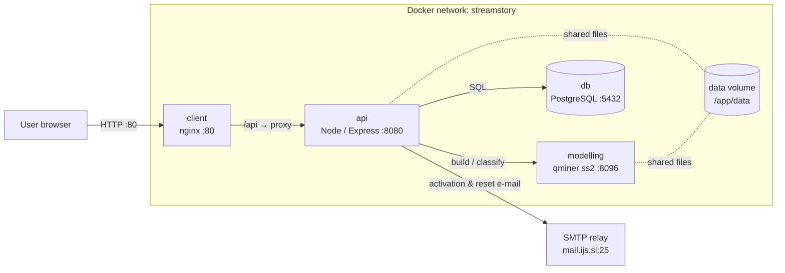

# Architecture

StreamStory is a set of small services run together with Docker Compose. The
browser talks only to the client; the client proxies API calls to the backend,
which owns the database, the modelling engine, and outgoing e-mail.



## Services

| Service   | Tech                        | Container port | Role |
|-----------|-----------------------------|----------------|------|
| client    | React (CRA), served by nginx | 80             | Web UI. In production nginx serves the built static files and proxies `/api` to the api service. |
| api       | Node 14, Express, TypeScript | 8080           | Private API (`/api`) and public API (`/api/v1`). Owns auth, sessions, models metadata, sends e-mail, delegates modelling. |
| modelling | C++ / [qminer](https://github.com/qminer/qminer) (`ss2` binary) | 8096 | Builds hierarchical models and classifies data. Compute-heavy; reachable only from the api. |
| db        | PostgreSQL                   | 5432           | Users, sessions, models, datasources, API keys, notifications. Schema auto-loaded on first start. |
| data      | Node, Express (dev only)     | 8081           | Auxiliary time-series provider (`/series`, `/series/last`) used during development. Not part of the production stack. |

## Published ports

Production ([docker-compose.yml](../docker-compose.yml)) publishes only the client;
everything else is reachable only inside the Docker network.

| Service   | Production            | Development ([docker-compose.dev.yml](../docker-compose.dev.yml)) |
|-----------|-----------------------|--------------------------------------------------|
| client    | `CLIENT_PORT` → 80    | `CLIENT_PORT:3000` → 3000 (CRA dev server) |
| api       | internal only (8080)  | `API_PORT:3001` → 8080 |
| data      | not deployed          | `DATA_PORT:3002` → 8081 |
| db        | internal only (5432)  | `DB_PORT:5432` → 5432 |
| modelling | internal only (8096)  | `MODELLING_PORT:8096` → 8096 |
| email     | none — external relay | MailHog container: UI on `EMAIL_CLIENT_PORT:8025`, SMTP `1025` internal |

In production there is no mail container: the api sends directly to the external
relay named in `config.json`.

In development the api sends mail to the bundled [MailHog](https://github.com/mailhog/MailHog)
container instead of a real relay, so activation e-mails are caught locally and
viewed at `http://localhost:8025`.

## Configuration model

Configuration is baked into the images at **build time**, not read at runtime.

```
configs/<CONFIG>/config.json          # per-environment template with $VARS
        │  envsubst (fills $VARS from .env)
        ▼
scripts/setupConfig.js <service>      # trims/derives the per-service config
        │
        ▼
image:  api   → config.json  (loaded into the CONFIG env var on start)
        client→ REACT_APP_CONFIG (compiled into the static bundle)
```

`CONFIG` selects which directory under [configs/](../configs) is used and is
passed through the build: `npm run build --config=<name>`. The main configs are
`development` and `production`. Secrets and ports come from `.env`
(see [deployment.md](deployment.md)).

## Data flow: building a model

1. The user uploads a dataset and configures a model in the client.
2. The api saves the uploaded file under `data/uploads/…` on the shared `data`
   volume and records model metadata in PostgreSQL.
3. The api calls the modelling service over HTTP at `http://modelling:8096`.
   modelling reads the dataset from the shared volume, builds the model, and
   returns it as JSON.
4. The api stores the returned model in PostgreSQL and the client renders it.

Classifying new data points follows the same api → `modelling:8096` path, and a
scheduled api job uses it to classify incoming streaming data.
